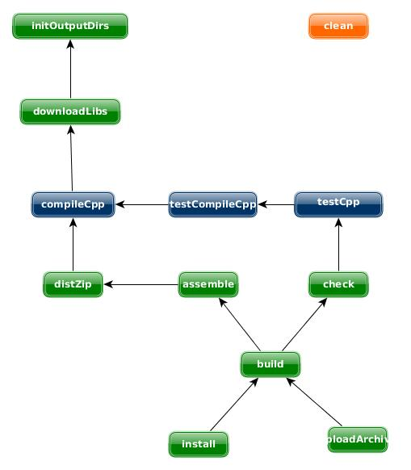

[](https://travis-ci.org/Tocea/gradle-cpp-plugin)
[](https://coveralls.io/r/Tocea/gradle-cpp-plugin?branch=master)

# gradle-cpp-plugin
Gradle C/C++ plugin with C++ build tools interactions. This plugins launches C++ build tools and adds Gradle capabilities like:

1. Dependencies management
2. Packaging
3. Upload
4. DAG of tasks
5. …

## Usage
To use the gradle-cpp-plugin, include the following in your build script:

**Example 1. Using the gradle-cpp-plugin**

**build.gradle**


```groovy
buildscript {
  repositories {
    maven {
      url "https://plugins.gradle.org/m2/"
    }
  }
  dependencies {
    classpath "gradle.plugin.fr.echoes.gradle.plugins:cpp-project-plugin:1.2.9"
  }
}
apply plugin: "fr.echoes.gradle.cpp"
```
## Source sets

The Cpp plugin is used to be used with this kind of structure of folders:

```
project
|-> build.gradle        // output folder
|-> build/
|-> src/
      |-> main/
            |-> headers/ //fichier hpp, h…
            |-> cpp/     // cpp,c files
     |-> test/
            |-> cpp/     // resources
```

## Tasks

The cpp plugin adds a number of tasks to your project, as shown below.

**Table 1. Cpp plugin - tasks**

| Task name        | Depends on      | Type    |  Description                                                    | 
| ---------------- | --------------  | ------- | --------------------------------------------------------------- |
| initOutputDirs   | -               | Task    | Initializes structure folders in project.buildDir directory      |
| downloadLibs     | initOutputDirs  | Task    | Copies project dependencies in project.buildDir/extLib directtory |
| compileCpp       | downloadLibs    | CppExecTask --> Exec    | Compiles source code. Needs to be configured to launch the correct tool |
| testCompileCpp       | compileCpp    | CppExecTask --> Exec    | Compile test source code. Needs to be configured te launch the correct tool |
| testCpp       | testCompileCpp    | CppExecTask --> Exec    | Launches test. Needs to be configured to launch the correct tool |
| distZip       | compileCpp    | Zip    | Assembles the ZIP file if it is a c-application or a CLIB file if it is a c-library |
| assemble       | all archives task as distZip    | Task    | Assembles the outputs of this project |
| check       | all tests task as testCpp    | Task    | Assembles the outputs of this project |
| build       | check and assemble    | Task    | Assembles and checks this project |
| install       | build    | Upload    | Uploads the distZip archive in the local repository |
| uploadArchive       | build    | Upload    | Uploads the distZip archive in a remote repository |

**Figure 1. Cpp plugin - tasks**




## Dependency management

The cpp plugin adds a number of dependencies configurations to your project, as shown below. It assigns those configurations to tasks such as compileCpp.

**Table 2. Cpp plugin - dependency configurations**

| Name        | extends    | Used by tasks    |  Used by tasks                 | 
| ----------- | ---------- | ---------------- | -------------------------------|
|  compile 	  | - 	       | compileJava 	 | Compile time dependencies      |
    

**Example 2. External dependencies** 

```groovy
dependencies {
    compile "fr.extern:sqlapi:4.1.4:lin_x86_64@clib"
    // or 
    compile group: "fr.extern", name: "sqlapi", version: "4.1.4", classifier: "lin_x86_64", ext: "clib"
}
```

**Example 3. Internal dependencies** 

```groovy
dependencies {
    compile project(path: ":projectPath", configuration: "cArchives"
}
```

## The notion of 'Projects'

*Gradle* is a **project** and **dependencies** manager. So, a gradle project must be seen as an **atomic project** which contains only:
* sources in `src/main/headers` and `src/main/cpp`
* test sources in `src/test/headers` and `src/test/cpp`
* configuration file (`build.gradle` and, for exemple with *CMake*,`CMakeLists.txt` locateds **only on the project root location**.

The C building tool under *Gradle* have to be able to:
* compile sources (with for example `make compile`)
* compile testSources (with for example `make testCompile`)
* execute test (with for example `make test`)

Projects examples can be found in the plugin source code in the `examples` folders.

**note:** at this time, I'm not a cmake expert. I do not succes to create all this make rules with *CMake*: I only manage to compile sources and test sources with the command `make` and launching test with the command `make test` using *ctest*.
If someone can tell me how to do this in the examples projects. All contributions will be appreciate:


*Cmake* project are used to have a `CMakeLists.txt` file in many folders. And C project are used to have libraries notions inside a project as we can see in this project: https://github.com/jameskbride/cmake-hello-world. 

### Example of possible refactorings for the project cmake-hello-world

In this project, a library 'hello' is used by the main file `helloWorld.cpp`. So, how is the good way to use this library? There are three ways to do that:

#### **Use the library as a sources.**

First choice, you considere that the 'hello' library, as the 'helloword.cpp' file is a part of the project et must be placed inside as sources:

**Example: A single gradle project**

```groovy
cmake-hello-world
|___build.gradle
|___gradle.properties
|___CmakeLists.txt
|___src/
    |___main/
        |___headers/
        |    |___Speaker.h
        |___cpp/
            |___Speaker.cpp
            |___helloWord.cpp
        
```

#### **Use the library as an external dependency**

Second choice, you considere that the 'hello' library has nothing to do with the project. This library can be used by many projects, in many computers. So create a gradle project 'hello-library', place the souces inside, and upload it in an artifact reposotory manager as [Nexus](http://www.sonatype.com/nexus/product-overview) for example.

Then in the project cmake-hello-world, use it as a dependency.

**Example: use hello dependency in the build.gradle file**
```groovy
dependencies {
    compile ("com.example:hello-library:1.0@clib"
}
```

#### **Use this library as a sub-module project**

Third choice, the 'hello' library has nothing to in this project. but this library is close of the project. The project and the library are a part of the same product. In this case, It can be a good idea te create a gradle project for this product which contain sub-modules (the 'hello' library and the 'cmake-hello-world' project).

**Example: gradle multi-modules project**
```groovy
exemple-project
|___settings.gradle
|___gradle.properties
|___build.gradle
|___hello-library
|   |___src/…
|   |___CMakeLists.txt
|   |___build.gradle
|___cmake-hello-world
    |___src/…
    |___CMakeLists.txt
    |___build.gradle
```

And adding in the cmake-hello-world/build.gradle the dependency to the 'hello-library'

```groovy
dependencies {
    compile project(path: ":hello-library", configuration: "cArchives")
}
```

#### **In Conclusion**:

The gradle cpp plugin create a real notion of **Projects** and **libraries**. User of this plugins have to have in minds these notions when they create their projects configurations with usual C tools (Make, CMake…).

You can find the 3 possibles solutions in the 'exemplek folders in the source code.

## Extension properties

The Java plugin adds a number of conventions properties to the project, shown below. You can use these properties in your build script as though they were properties of the project object. 

**Table 3. Cpp plugin - Project projerties**
    
| Name        | Type       | Default value    |  Description          | 
| ----------- | ---------- | ---------------- | -------------------------------|
|  cpp 	  | CppPluginExtension 	       | - 	 | Contains the configuration of cpp      |
    
**Example 2. Cpp extension exemple** 

```groovy
cpp {
 // some contents
}
```

**Table 4. Cpp plugin - CppPluginExtension projerties**
    
| Name        | Type    | Default value    |  Description          | 
| ----------- | ---------- | ---------------- | -------------------------------|
|  applicationType | ApplicationType | ApplicationType.clibrary | Type of project: ApplicationType.clibrary or ApplicationType.capplication |
|  classifier | String | classifier | Allows to distinguish artifacts for a same version. |
|  buildTasksEnabled | boolean | true | Activates or desactivates the compileCpp, testCompileCpp, testCpp tasks |
|  exec | CppExecConfiguration | - | Configures the builds tasks |

**Example 4. Cpp extension exemple** 

```groovy
cpp {
  applicationType = "capplication"
  classifier = "lin_gcc_x32_64"
  buildTasksEnabled = true
  exec.with {
    // some contents
  }
}
```

**Table 5. Cpp plugin - CppExecConfiguration projerties**
    
| Name        | Type    | Default value    |  Description          | 
| ----------- | ---------- | ---------------- | -------------------------------|
|  execPath | String | "" | Path of the executable for all tasks of type CppExecTask |
| env       | java.util.Map | null | Environment variables map for all tasks of type CppExecTask |
| ${task.name}ExecPath | String | "" | Path of the executable for the task ${task.name} of type CppExecTask (overrides the execPath value)|
| ${task.name}BaseArgs | String | null | Arguments of the command launched by the task ${task.name} of type CppExecTask |
| ${task.name}Args | String | "" | More arguments of the command launched by the task  ${task.name} of type CppExecTask |
| ${task.name}ExecWorkingDir | String | null | File location to execute the command launched by the task ${task.name} of type CppExecTask |
| ${task.name}StandardOutput | OutputStream  | null | Output stream used to store the result of the command launched by the task ${task.name} of type CppExecTask |

**Example 5. CppExecConfiguration example** 

```groovy
cpp {
  exec.with {
    execPath = 'echo' 
    env = [JAVA_HOME: "/usr/lib/jvm/java-8-oracle"]
    compileCppExecPath = "make"
    compileCppBaseArgs = "compile"
    compileCppExecWorkingDir = "build"
  }
}
```
## Clean
The clean task is an instance of Delete. It simply removes the directory denoted by its ${project.buildDir} property. 

## modules 
To simplify the configurations of the C build tools, some modules are provideds. At this time only cmake modules are provided.

Provided lists: 
* [CMake modules](docs/modules/cmake-modules.md)

## Example of configuration with Cmake

**Example 6. Example of build.gradle to use cmake** 

```groovy

task launchCMake(type: Exec, group: "init") {

    workingDir = buildDir
    executable = "cmake"
    args  ".."
}

compileCpp.dependsOn launchCMake

cpp {
  applicationType = "clibrary"
  exec.with {
    execPath = 'echo' 
    compileCppExecPath = "make"
    compileCppBaseArgs = "compile"
    compileCppExecWorkingDir = "build"
  }
}
```

Then launch the build.

```
> gradle build
```

An example of console output.

```
extern:externlib:clean
:extern:externlib:initOutputDirs
:extern:externlib:downloadLibs
:extern:externlib:launchCMake
-- The C compiler identification is GNU 4.9.2
-- The CXX compiler identification is GNU 4.9.2
-- Check for working C compiler: /usr/bin/cc
-- Check for working C compiler: /usr/bin/cc -- works
-- Detecting C compiler ABI info
-- Detecting C compiler ABI info - done
-- Check for working CXX compiler: /usr/bin/c++
-- Check for working CXX compiler: /usr/bin/c++ -- works
-- Detecting CXX compiler ABI info
-- Detecting CXX compiler ABI info - done
CMake Warning (dev) in CMakeLists.txt:
  No cmake_minimum_required command is present.  A line of code such as

    cmake_minimum_required(VERSION 3.0)

  should be added at the top of the file.  The version specified may be lower
  if you wish to support older CMake versions for this project.  For more
  information run "cmake --help-policy CMP0000".
This warning is for project developers.  Use -Wno-dev to suppress it.

-- Configuring done
-- Generating done
-- Build files have been written to: /where/it/should/be/build
:extern:externlib:validateCMake
:extern:externlib:compileCpp
  …
:extern:externlib:copyHeaders
:extern:externlib:cppArchive UP-TO-DATE
:extern:externlib:distTar
:extern:externlib:distZip
:extern:externlib:assemble
:extern:externlib:testCompileCpp

:extern:externlib:testCpp

:extern:externlib:check
:extern:externlib:build
```

