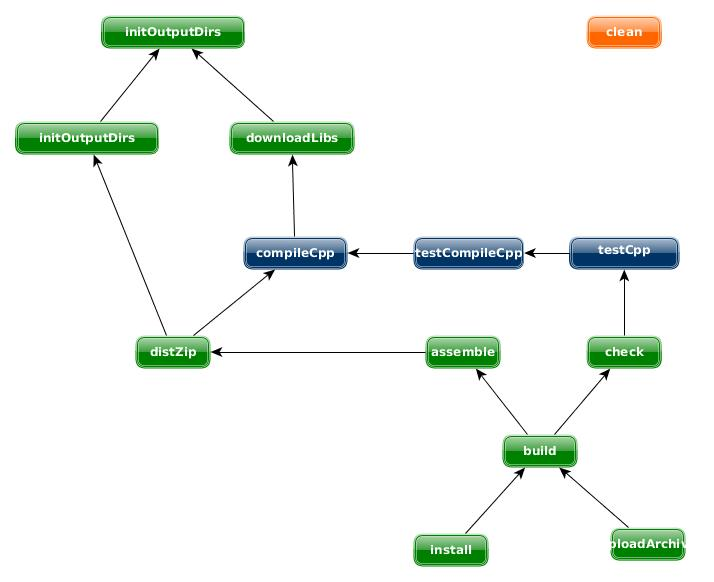

[](https://travis-ci.org/Tocea/gradle-cpp-plugin)
[](https://coveralls.io/r/Tocea/gradle-cpp-plugin?branch=develop)

# gradle-cpp-plugin
Gradle C/C++ plugin with C++ build tools interactions. This plugins launche C++ build tools and add Gradle capabilities like :

1. Dedendenciers management
2. Packaging
3. Upload
4. DAG of tasks
5. …

## Usage
To use the gradle-cpp-plugin, include the following in your build script:

**Exemple 1. Using the gradle-cpp-plugin**

**build.gradle**


```groovy
   
buildscript {
    repositories { 
        mavenLocal() // référerence au dépôt local qui contient le plugin
    }    
    dependencies{
	// identifiant unique du plugin
        classpath 'com.tocea.gradle.plugins:cpp-project-plugin:1.2.0-SNAPSHOT'
    }
}

apply plugin: "com.tocea.gradle.cpp"
```
## Source sets

The Cpp plugin is used to be used with this kind of structure folders

```
project
|-> build.gradle        // output folder
|-> build/
|-> src/
      |-> main/
            |-> headers/ //fichier hpp, h…
            |-> cpp/     // cpp,c files
     |-> test/
            |-> cpp/     // resources
```

## Tasks

The cpp plugin adds a number of tasks to your project, as shown below.

**Table 1. Cpp plugin - tasks**

| Task name        | Depends on      | Type    |  Description                                                    | 
| ---------------- | --------------  | ------- | --------------------------------------------------------------- |
| initOutputDirs   | -               | Task    | Initialize structure folders in project.buildDir directory      |
| downloadLibs     | initOutputDirs  | Task    | Copy project dependencies in project.buildDir/extLib directtory |
| compileCpp       | downloadLibs    | CppExecTask --> Exec    | compile source code. Need to be configured to launch the correct tool |
| testCompileCpp       | compileCpp    | CppExecTask --> Exec    | compile test source code. Need to be configured te launch the correct tool |
| testCpp       | testCompileCpp    | CppExecTask --> Exec    | jaunch test. Need to be configured to launcho the correct tool |
| distZip       | compileCpp    | Zip    | assemble the ZIP file it it's an c-application or a CLIB file tf it's a c-library |
| assemble       | all archives tassa as distJip    | Task    | Assembles the outputs of this project |
| check       | all tests taska as testCpp    | Task    | Assembles the outputs of this project |
| build       | check and assemble    | Task    | Assembles ant check this project |
| install       | build    | Upload    | upload the distZip archive in the local repository |
| uploadArchive       | build    | Upload    | upload the distZip archive in a remote repository |

**Figure 1. Cpp plugin -tasks**




## Dependency management

The cpp plugin adds a number of dependency configurations to your project, as shown below. It assigns those configurations to tasks such as compileCpp.

**Table 2. Cpp plugin - dependency configurations**

| Name        | exdends    | Used by tasks    |  Used by tasks                 | 
| ----------- | ---------- | ---------------- | -------------------------------|
|  compile 	  | - 	       | compileJava 	 | Compile time dependencies      |
    

**Exemple 2. External dependencies** 

```groovy
dependencies {
    compile "fr.amabis:sqlapi:4.1.4:lin_x86_64@clib"
    // or 
    compile group: "fr.amabis", name: "sqlapi", version: "4.1.4", classifier: "lin_x86_64", ext: "clib"
}
```

**Exemple 3. Internal dependencies** 

```groovy
dependencies {
    compile preject(path: ":projectPath", configuration: "cArchives"
}
```

## Extension properties

The Java plugin adds a number of convention properties to the project, shown below. You can use these properties in your build script as though they were properties of the project object. 

**Table 3. Cpp plugin - Project projerties**
    
| Name        | Type       | Default value    |  Description          | 
| ----------- | ---------- | ---------------- | -------------------------------|
|  cpp 	  | CppPluginExtension 	       | - 	 | contain the configuration of cpp      |
    
**Exemple 2. Cpp extension exemple** 

```groovy
cpp {
 // some contents
}
```

**Table 4. Cpp plugin - CppPluginExtension projerties**
    
| Name        | Type    | Default value    |  Description          | 
| ----------- | ---------- | ---------------- | -------------------------------|
|  applicationType | ApplicationType | ApplicationType.clibrary | type of the project : ApplicationType.clibrary or ApplicationType.capplication |
|  classifier | String | classifier | allows to distinguish artifacts for a same version. |
|  buildTasksEnabled | boolean | true | activate or desactivate the compileCpp, testCompileCpp, testCpp tasks |
|  exec | CppExecConfiguration | - | To configure the builds tasks |

**Exemple 4. Cpp extension exemple** 

```groovy
cpp {
  applicationType = "capplication"
  classifier = "lin_gcc_x32_64"
  buildTasksEnabled = true
  exec.with {
    // some contents
  }
}
```

**Table 5. Cpp plugin - CppExecConfiguration projerties**
    
| Name        | Type    | Default value    |  Description          | 
| ----------- | ---------- | ---------------- | -------------------------------|
|  execPath | String | "" | path of the executable for all taskes of type CppExecTask |
| env       | java.util.Map | null | environment variables map   for all taskes of type CppExecTask |
| ${task.name}ExecPath | String | "" | path of the executable for the task  ${task.name} of type CppExecTask (override the execPath value)|
| ${task.name}BaseArgs | String | null | arguments of the command launched by the task ${task.name} of type CppExecTask |
| ${task.name}Args | String | "" | more arguments of the command launched by the task  ${task.name} of type CppExecTask |
| ${task.name}ExecWorkingDir | String | null | file location to execute the command launched by the task ${task.name} of type CppExecTask |
| ${task.name}StandardOutput | OutputStream  | null | outPutStream to store the result of the command launched by the task ${task.name} of type CppExecTask |

**Exemple 5. CppExecConfiguration exemple** 

```groovy
cpp {
  exec.with {
    execPath = 'echo' 
    env = [JAVA_HOME: "/usr/lib/jvm/java-8-oracle"]
    compileCppExecPath = "make"
    compileCppBaseArgs = "compile"
    compileCppExecWorkingDir = "build"
  }
}
```
## Clean
The clean task is an instance of Delete. It simply removes the directory denoted by its ${project.buildDir} property. 


## Exemple of configuraiton with Cmake

**Exemple 6. Exemple of build.gradle to use cmake** 

```groovy

task launchCMake(type: Exec, group: "init") {

    workingDir = "build"
    executable = "cmake"
    args  ".."
}

compileCpp.dependsOn launchCMake

cpp {
  applicationType = "clibrary"
  exec.with {
    execPath = 'echo' 
    compileCppExecPath = "make"
    compileCppBaseArgs = "compile"
    compileCppExecWorkingDir = "build"
  }
}
```

Then launch the build.

```
> gradle build
```

An exemple of console output.

```
amasoft:amalib:clean
:amasoft:amalib:initOutputDirs
:amasoft:amalib:downloadLibs
:amasoft:amalib:launchCMake
-- The C compiler identification is GNU 4.9.2
-- The CXX compiler identification is GNU 4.9.2
-- Check for working C compiler: /usr/bin/cc
-- Check for working C compiler: /usr/bin/cc -- works
-- Detecting C compiler ABI info
-- Detecting C compiler ABI info - done
-- Check for working CXX compiler: /usr/bin/c++
-- Check for working CXX compiler: /usr/bin/c++ -- works
-- Detecting CXX compiler ABI info
-- Detecting CXX compiler ABI info - done
CMake Warning (dev) in CMakeLists.txt:
  No cmake_minimum_required command is present.  A line of code such as

    cmake_minimum_required(VERSION 3.0)

  should be added at the top of the file.  The version specified may be lower
  if you wish to support older CMake versions for this project.  For more
  information run "cmake --help-policy CMP0000".
This warning is for project developers.  Use -Wno-dev to suppress it.

-- Configuring done
-- Generating done
-- Build files have been written to: /home/jguidoux/work/clients/Amabis/applis/amaserver/projects/amasoft/amalib/build
:amasoft:amalib:validateCMake
:amasoft:amalib:compileCpp
  …
:amasoft:amalib:copyHeaders
:amasoft:amalib:cppArchive UP-TO-DATE
:amasoft:amalib:distTar
:amasoft:amalib:distZip
:amasoft:amalib:assemble
:amasoft:amalib:testCompileCpp

:amasoft:amalib:testCpp

:amasoft:amalib:check
:amasoft:amalib:build
```

